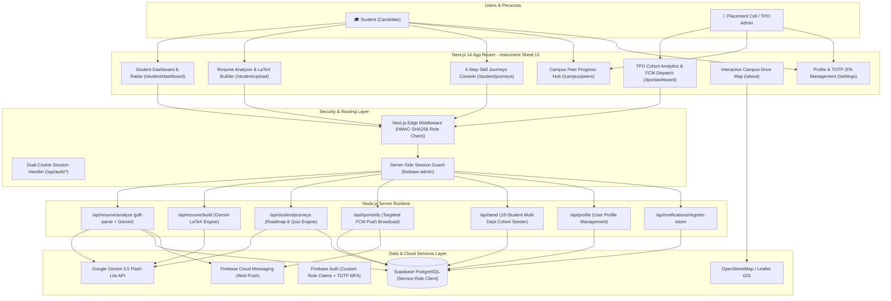

# 🎓 Campus Career Copilot

> **AI-Powered Institutional Placement Intelligence & Skill Readiness Platform**  
> Designed for universities and engineering colleges. Connects **Students** and the **Placement Cell (Training & Placement Officers / TPO)** into a unified ecosystem featuring transparent peer benchmarking, AI-driven competency gap diagnosis, 4-step gamified skill journeys, LaTeX resume generation, and real-time push intervention broadcasts.

---

## 🌟 Key Highlights

- 👥 **Campus Peer Progress Hub**: Transparent cross-department institutional directory (`/campus/peers`) to explore classmates' technical skill profiles, target career roles, readiness scores, 360° competency radars, and active learning milestones.
- 🗺️ **4-Step AI Skill Journeys**: Transforms detected resume skill gaps into structured, 4-stage actionable learning roadmaps powered by **Google Gemini 3.5 Flash Lite**:
  1. **Concept**: Technical foundations, core concepts, and curated GitHub notes/repository links.
  2. **Course**: Specific recommended course from reputable providers (Coursera, Udemy, edX) with direct links.
  3. **Challenge**: Hands-on practical implementation task or project specification.
  4. **Quiz**: Full MCQ examination (5–10 questions) with automated grading and instant feedback.
  - *Anti-Link-Rot Guarantee*: Video resources dynamically use YouTube search queries (`youtube.com/results?search_query=...`) to prevent broken links.
- 📄 **AI LaTeX Resume Builder & PDF Parser**:
  - **Resume PDF Analyzer**: Server-side plain-text extraction via `pdf-parse` + evaluation by Gemini AI against branch-specific standards to produce a calibrated **0–100 Readiness Score**, extracted competencies, and prioritized skill gaps.
  - **AI LaTeX Builder**: Dynamic multi-section form (`components/ResumeBuilder.tsx`, `/api/resume/build`) generating standalone, compilable single-page LaTeX code with 1-click copy and Overleaf compilation integration.
- 📊 **TPO Cohort Diagnostics & Interventions**: Real-time batch placement health indicators, horizontal severity-coded gap frequency charts (Recharts), multi-branch/year filters, urgency-ranked student rosters, and 1-click targeted workshop push notifications via **Firebase Cloud Messaging (FCM)**.
- ⚙️ **11 Engineering Disciplines**: First-class support for 11 departments (`lib/departments.ts`): CSE, IT, ECE, EE, ME, CE, Chemical, Data Science & AI, Production & Industrial, Biotechnology, and Other—with tailored career tracks and specialized AI evaluation prompts.
- 🛡️ **Dual-Cookie Edge Architecture & 2FA**:
  - **Firebase Session Cookie**: 5-day HTTP-only session cookie verified server-side by `firebase-admin`.
  - **Edge HMAC-SHA256 Role Cookie**: 14-day signed `session_role` cookie (`lib/auth/role-cookie.ts` via Web Crypto API) enabling Next.js Edge Middleware (`middleware.ts`) to execute instantaneous role-based routing with zero network roundtrips.
  - **Two-Factor Authentication (2FA / TOTP)**: Integrated Firebase MFA enrollment with QR code generation (`components/auth/TwoFactorSetup.tsx`).
- 🗺️ **Interactive Campus & Drive Mapping**: React-Leaflet OpenStreetMap on `/about` (`CampusMap.tsx`) plotting institutional placement headquarters and confirmed corporate recruitment drives.

---

## 🏛️ System Architecture



---

## 🛠️ Technology Stack

| Category | Technology | Version | Purpose & Implementation |
| :--- | :--- | :--- | :--- |
| **Framework** | [Next.js](https://nextjs.org/) | `^14.2.0` | React Server Components (RSC), App Router, dynamic imports, Edge middleware, and Node.js Route Handlers. |
| **UI Library** | [React](https://react.dev/) | `^18.3.0` | Modern React with hooks, Context API, and Suspense streaming. |
| **Styling** | [Tailwind CSS](https://tailwindcss.com/) | `^3.4.0` | Design System ("Instrument Sheet", seed `ins-84d2`), dual-tier graph-paper CSS grid (8px/40px), custom scrollbars. |
| **Typography** | [Google Fonts](https://fonts.google.com/) | `next/font` | **Archivo** (primary UI voice, 400–800) and **IBM Plex Mono** (readings, scores, serials, data labels). |
| **AI / LLM Engine** | [Google Gemini](https://ai.google.dev/) | `@google/generative-ai` `^0.24.1` | `gemini-3.5-flash-lite` for JSON resume evaluation, 4-step learning journeys, and raw LaTeX code generation. |
| **Document Parser** | [`pdf-parse`](https://www.npmjs.com/package/pdf-parse) | `^1.1.1` | Server-side plain-text extraction from uploaded PDF resumes. |
| **Database** | [Supabase](https://supabase.com/) | `@supabase/supabase-js` `^2.43.0` | PostgreSQL database managed with 6 SQL migrations, accessed server-side via `supabaseAdmin` service-role key. |
| **Auth & 2FA** | [Firebase Auth](https://firebase.google.com/products/auth) | `firebase` `^10.12.0` | Client authentication, custom role claims, and TOTP Two-Factor Authentication (MFA). |
| **Server Admin** | [Firebase Admin SDK](https://firebase.google.com/docs/admin/setup) | `firebase-admin` `^12.1.0` | Session cookie minting, server token verification, custom claims assignment, and push notification dispatch. |
| **Push Alerts** | [Firebase Cloud Messaging](https://firebase.google.com/products/cloud-messaging) | `firebase/messaging` | Real-time web push notifications with service worker (`public/firebase-messaging-sw.js`). |
| **Visualizations** | [Recharts](https://recharts.org/) | `^2.12.0` | 360° `SkillRadarChart` and horizontal cohort gap frequency bar charts. |
| **Motion** | [Framer Motion](https://www.framer.com/motion/) | `^13.1.0` | Page transition spring physics (`template.tsx`), gauge card entrance animations, and `MotionConfig`. |
| **Mapping & GIS** | [Leaflet](https://leafletjs.com/) & [React-Leaflet](https://react-leaflet.js.org/) | `^1.9.4` / `^4.2.1` | Interactive OpenStreetMap campus placement map with custom-styled HTML `divIcon` pins. |
| **Icons & Toasts** | [Lucide React](https://lucide.dev/) & [Sonner](https://sonner.emilkowal.ski/) | `^1.31.0` / `^2.0.8` | Consistent `1.8` stroke width iconography and instrument-themed toast notifications. |

---

## 🚀 Core Features & Workflows

### 🎓 1. For Students (`/student/*`, `/campus/*`, `/settings`)

- **Instant AI Resume Evaluation (`/student/upload` → `/student/dashboard`)**:
  - Drag-and-drop PDF resume upload (up to 5MB).
  - Server extracts text via `pdf-parse` and analyzes competencies against target role and engineering branch using `gemini-3.5-flash-lite`.
  - Generates a **0–100 Placement Readiness Score**, extracted technical skills list, summary assessment, and prioritized skill gaps with severity rankings (`high`, `medium`, `low`).
  - Renders a 360° **Competency Radar Chart** contrasting mastered skills against gap areas.
- **Interactive AI LaTeX Resume Builder (`/student/upload` Tab 2)**:
  - Dynamic multi-section form capturing Personal Info, Summary, Experience, Projects, Education, Technical Skills, and Achievements.
  - Generates compilable, standalone, single-page LaTeX code using Gemini AI with special-character escaping.
  - 1-click **Copy LaTeX** action and direct integration link to compile on Overleaf.
- **4-Step Gamified AI Skill Journeys (`/student/journeys`)**:
  - Converts detected skill gaps into tailored 4-stage learning quests:
    - **Step 1 (Concept)**: Technical foundations, core concepts, and curated GitHub repository links.
    - **Step 2 (Course)**: Structured recommendation of reputable online courses (Coursera, Udemy, edX) with links.
    - **Step 3 (Challenge)**: Practical implementation task/project specification.
    - **Step 4 (Quiz)**: Interactive MCQ exam (5–10 questions) with automated grading and instant feedback.
  - Passing the quiz marks the skill gap as **Mastered** and updates the student's competency profile.
- **Campus Peer Progress Hub (`/campus/peers` & `/campus/peers/[peerId]`)**:
  - Searchable, filterable student directory across all 11 departments.
  - Inspect individual peer profiles, 360° competency radars, completed journey milestones, and GitHub/LinkedIn links for study circle formation.
- **Settings & Two-Factor Authentication (`/settings`)**:
  - Update profile details (branch, batch year, target role, GitHub and LinkedIn URLs).
  - Enroll in TOTP 2FA using Google Authenticator or compatible authenticator apps via QR code.

---

### 🏢 2. For Placement Cell / TPO (`/tpo/*`)

- **Cohort Readiness Diagnostics (`/tpo/dashboard`)**:
  - Real-time gauge bank: Registered Students, Resumes Evaluated, Batch Average Score, High-Priority Gaps count, and Gaps Resolved count.
  - **Horizontal Skill Gap Distribution Chart**: Recharts bar chart showing the percentage and count of students affected by each specific skill gap across the cohort.
  - Multi-dimensional filtering by severity (`all`, `high`, `medium`, `low`), engineering department (11 branches), and batch year.
- **Urgency-Ranked Student Roster**:
  - Full student table sorted weakest-first by urgency of intervention.
  - Displays Student Name, Department, Target Role, Readiness Score (color-coded status badges), and Completed/Active skill quests count.
- **Targeted Workshop Push Broadcasts (`Modal` & `/api/tpo/notify`)**:
  - Click **Notify affected** on any skill gap in the diagnostic chart.
  - System identifies all students with that missing competency and dispatches real-time **Firebase Cloud Messaging (FCM)** push notifications with a customizable workshop alert message.
- **1-Click Demo Cohort Seeder (`/api/seed`)**:
  - Instantly resets and populates 18 realistic student accounts across 7 branches (CSE, ME, CE, ECE, EE, Chemical, IT).
  - Generates realistic resume scores (60–95), verified skill tags, prioritized gap lists, active/completed learning journeys, and 6 scheduled campus company drive visits with geographic coordinates.

---

## 🔒 Authentication, Security & Edge Routing

Campus Career Copilot implements a high-performance **Dual-Cookie Edge Authentication Architecture**:

```
[ Browser / Client ]
      │
      ├── (1) POST /api/auth/session (Firebase ID Token)
      │         │
      │         ├── adminAuth.createSessionCookie(idToken) ──► Set-Cookie: session (5 days, HttpOnly)
      │         └── signRoleCookie(role) [HMAC-SHA256]    ──► Set-Cookie: session_role (14 days, HttpOnly)
      │
      ├── (2) Navigates to /student/dashboard or /tpo/dashboard
      │         │
      │         └── Next.js Edge Middleware (middleware.ts)
      │               ├── Reads 'session_role' cookie
      │               ├── Verifies HMAC-SHA256 signature locally (Web Crypto API - 0ms network hops)
      │               └── Allows or redirects unauthenticated / unauthorized requests instantly
      │
      └── (3) Invokes API Route (e.g. POST /api/resume/analyze)
                │
                └── Node.js Route Handler (app/api/*)
                      ├── verifySession(req) validates 'session' cookie via firebase-admin
                      └── Executes database queries via supabaseAdmin (service-role key)
```

### Security Highlights
1. **Zero-Latency Edge Route Protection**: `middleware.ts` runs on the Edge runtime and uses the Web Crypto API to verify the HMAC-signed `session_role` cookie (`ROLE_COOKIE`) in microseconds without internal API network roundtrips.
2. **Server-Side Token Verification**: Every API route strictly verifies the Firebase session cookie with `firebase-admin` before reading or modifying database records.
3. **Role-Based Access Control (RBAC)**: Enforces strict separation between `student` and `tpo` roles. Cross-role navigation automatically redirects to the user's designated console.
4. **Service-Role Database Security**: Supabase PostgreSQL is accessed exclusively through server-side Node.js API handlers using the `SUPABASE_SERVICE_ROLE_KEY`.

---

## 🗄️ Database Architecture & Migrations

The database schema is managed in Supabase PostgreSQL via **6 sequential migration scripts** located in `supabase/migrations/`:

```
supabase/migrations/
├── 0001_init.sql                       # Initial tables (users, resumes, jds, company_visits) & indexes
├── 0002_fix_user_id_type.sql           # Modifies users.id & FKs from UUID to TEXT (Firebase UID compatibility)
├── 0003_add_fcm_token.sql              # Adds fcm_token column to users table for push targeting
├── 0004_campus_progress_and_journeys.sql # Adds department/links to users; creates skill_journeys table
├── 0005_drop_department_default.sql    # Drops 'Computer Science' default for explicit 11-branch selection
└── 0006_disable_rls.sql                # Disables RLS across all tables (Service-Role + Firebase Admin model)
```

### Why Row Level Security (RLS) is Disabled in Migration 0006
1. **Authentication Ownership**: Authentication is managed by **Firebase Auth**, not Supabase Auth. Supabase issues no JWTs; therefore, Postgres `auth.uid()` evaluates to `NULL` for all queries.
2. **Server-Side Mediation**: All Supabase interactions occur strictly inside server-side Node.js route handlers (`app/api/*`) using the `supabaseAdmin` service-role key (`lib/supabase/server.ts`), which bypasses RLS unconditionally.
3. **No Direct Client Access**: The client never connects directly to Supabase (`lib/supabase/client.ts` was deleted). Gating access via server-side `verifySession(req)` guarantees that unauthenticated requests are rejected before any database query executes.

---

## 📡 API Endpoint Index

All API route handlers execute on the Node.js runtime (`export const runtime = 'nodejs'`):

| Method | Endpoint | Auth Required | Role Gated | Request Body / Payload | Response Payload | Description |
| :--- | :--- | :--- | :--- | :--- | :--- | :--- |
| `POST` | `/api/auth/session` | ID Token | Any | `{ idToken: string }` | `{ ok: true, role: string }` | Verifies Firebase ID token, mints 5-day `session` cookie and 14-day HMAC `session_role` cookie. |
| `DELETE` | `/api/auth/session` | None | Any | None | `{ ok: true }` | Clears `session` and `session_role` HTTP-only cookies on sign out. |
| `POST` | `/api/auth/set-role` | ID Token | Invite Gated | `{ idToken, inviteCode, department? }` | `{ ok: true, role: 'student' \| 'tpo' }` | Validates invite code (`STUDENT_INVITE_CODE` or `TPO_INVITE_CODE`), sets Firebase custom user claims, upserts `users` record in Supabase, and sets HMAC role cookie. |
| `GET` | `/api/auth/verify-session` | Session Cookie | Any | None | `{ uid: string, role: string \| null }` | Server-side verification of Firebase session cookie. |
| `GET` | `/api/profile` | Session Cookie | Student / TPO | None | `{ name, department, batch_year, target_role, github_url, linkedin_url, role }` | Retrieves user profile data. |
| `PATCH` | `/api/profile` | Session Cookie | Student / TPO | Partial `{ name, department, batch_year, target_role, github_url, linkedin_url }` | `{ success: true }` | Updates editable user profile fields. |
| `POST` | `/api/resume/analyze` | Session Cookie | Student | `FormData` (`resume`: PDF File, `targetRole`: string) | `{ ok: true, resume: object, summary: string }` | Parses PDF text via `pdf-parse`, evaluates readiness & skill gaps with Gemini AI, updates `resumes`, and triggers FCM alert. |
| `POST` | `/api/resume/build` | Session Cookie | Student | JSON `{ personalInfo, education, experience, skills, projects, achievements }` | `{ ok: true, latex: string }` | Generates compilable standalone LaTeX resume document code using Gemini AI (`GEMINI_RESUME_BUILDER_API_KEY`). |
| `GET` | `/api/student/journeys` | Session Cookie | Student / TPO | Query `?userId=...` (optional for TPO) | `{ journeys: [], availableGaps: [], extractedSkills: [], overallScore: number }` | Returns active learning journeys, available resume gaps, and overall readiness score. |
| `POST` | `/api/student/journeys` | Session Cookie | Student | Action `generate`: `{ action: 'generate', skill, severity }`<br>Action `toggle_step`: `{ action: 'toggle_step', journeyId, stepNumber, completed }`<br>Action `verify_quiz`: `{ action: 'verify_quiz', journeyId, answers: {} }` | Generated journey object / step update status / quiz feedback & pass status | Creates 4-step AI journey, toggles step completion, or grades interactive MCQ quiz. |
| `GET` | `/api/tpo/notify` | Session Cookie | TPO | None | `{ skills: string[] }` | Returns sorted array of distinct skill gap names present across all evaluated student resumes. |
| `POST` | `/api/tpo/notify` | Session Cookie | TPO | `{ skill: string, message?: string }` | `{ ok: true, notifiedCount: number, actuallySent: number, affectedStudents: string[] }` | Queries students with the specified gap, retrieves FCM tokens, and dispatches targeted push notifications. |
| `POST` | `/api/seed` | Session Cookie | TPO | None | `{ ok: true, seeded: 18 }` | Resets and seeds 18 demo student profiles across 7 engineering branches, scores (60–95), journeys, and 6 campus drive visits. |
| `POST` | `/api/notifications/register-token` | Session Cookie | Student / TPO | `{ token: string }` | `{ ok: true }` | Stores the user's FCM Web Push registration token in Supabase `users.fcm_token`. |

---

## 📁 Directory Structure

```
campus-career-copilot/
├── app/
│   ├── (dashboard)/                     # Protected dashboard layout & views
│   │   ├── campus/
│   │   │   └── peers/
│   │   │       ├── [peerId]/page.tsx    # Peer profile deep-dive with radar & journeys
│   │   │       ├── PeerProgressClient.tsx # Client-side search, department filter & sorter
│   │   │       └── page.tsx             # Campus Peer Progress Hub directory
│   │   ├── student/
│   │   │   ├── dashboard/
│   │   │   │   ├── SkillRadarChart.tsx  # Recharts 360° radar component
│   │   │   │   └── page.tsx             # Student dashboard (score, radar, gaps, quests)
│   │   │   ├── journeys/
│   │   │   │   ├── GapList.tsx          # Available gaps selector
│   │   │   │   ├── JourneyDetail.tsx    # 4-step milestone viewer (concept, course, challenge, quiz)
│   │   │   │   ├── JourneyList.tsx      # Active & completed journeys list
│   │   │   │   ├── QuizBlock.tsx        # Interactive MCQ quiz component
│   │   │   │   ├── SkillJourneyClient.tsx # Skill journey console state manager
│   │   │   │   └── page.tsx             # Skill journeys page
│   │   │   └── upload/
│   │   │       └── page.tsx             # Resume upload (PDF analyzer & LaTeX builder tabs)
│   │   ├── tpo/
│   │   │   └── dashboard/
│   │   │       ├── CohortAnalyticsClient.tsx # Batch analytics, gap chart, FCM modal, seeder
│   │   │       └── page.tsx             # TPO diagnostic dashboard
│   │   ├── settings/
│   │   │   └── page.tsx                 # Profile settings & TOTP 2FA enrollment
│   │   ├── layout.tsx                   # Server session check & sidebar navigation shell
│   │   ├── loading.tsx                  # Root skeleton loader
│   │   └── template.tsx                 # Page route transition motion wrapper
│   ├── (public)/                        # Publicly accessible routes
│   │   ├── about/
│   │   │   ├── CampusMap.tsx            # React-Leaflet interactive drive map
│   │   │   └── page.tsx                 # About page with 3 system diagrams & drives list
│   │   ├── login/
│   │   │   └── page.tsx                 # Sign-in screen with TOTP 2FA challenge
│   │   └── signup/
│   │       └── page.tsx                 # Registration with invite code & 11-branch selector
│   ├── api/                             # Backend API Route Handlers (Node.js runtime)
│   │   ├── auth/
│   │   │   ├── session/route.ts         # Session cookie & HMAC role cookie issuance / deletion
│   │   │   ├── set-role/route.ts        # Invite code verification, claims, Supabase user upsert
│   │   │   └── verify-session/route.ts  # Session cookie validation
│   │   ├── notifications/
│   │   │   └── register-token/route.ts  # FCM device push token registration
│   │   ├── profile/route.ts             # Profile retrieval & update
│   │   ├── resume/
│   │   │   ├── analyze/route.ts         # PDF text extraction & Gemini resume evaluation
│   │   │   └── build/route.ts           # Gemini raw LaTeX resume generator
│   │   ├── seed/route.ts                # 18-student multi-branch demo cohort seeder
│   │   ├── student/
│   │   │   └── journeys/route.ts        # 4-step AI journey creation & quiz grading
│   │   └── tpo/
│   │       └── notify/route.ts          # Gap aggregation & targeted FCM push dispatch
│   ├── globals.css                      # Two-tier graph paper grid & design system base
│   ├── icon.svg                         # Bespoke CC instrument brand icon (App Router metadata)
│   ├── layout.tsx                       # Root layout with fonts & Providers wrapper
│   ├── NotificationListener.tsx         # Client foreground FCM push listener
│   ├── not-found.tsx                    # Custom 404 page
│   ├── error.tsx                        # Custom error boundary
│   └── page.tsx                         # Landing page with interactive live InstrumentPanel
├── components/                          # UI components
│   ├── auth/
│   │   └── TwoFactorSetup.tsx           # TOTP MFA QR code & enrollment component
│   ├── landing/
│   │   └── InstrumentPanel.tsx          # Live animated instrument preview on landing page
│   ├── ui/                              # Design system primitives
│   │   ├── Badge.tsx                    # Badges & SeverityBadges
│   │   ├── Button.tsx                   # Button variants (primary, signal, outline, ghost, danger)
│   │   ├── ChipInput.tsx                # Tag input component
│   │   ├── EmptyState.tsx               # Empty state panel
│   │   ├── Field.tsx                    # Form primitives (Field, Input, Select, Textarea)
│   │   ├── Modal.tsx                    # Accessible modal dialog with focus trap
│   │   ├── NavProgress.tsx              # Top hairline navigation progress bar
│   │   ├── NavigationProgress.tsx       # Route navigation progress bar
│   │   ├── PageHeader.tsx               # Sheet header with title, sub, actions & serial meta
│   │   ├── Progress.tsx                 # Tick-marked progress bar with sweep animation
│   │   ├── Providers.tsx                # MotionConfig, NavProgress & Sonner provider
│   │   ├── Sheet.tsx                    # Sheet container & TitleBlock header strip
│   │   ├── Skeleton.tsx                 # Skeleton loaders & SheetSkeleton
│   │   └── Stat.tsx                     # Calibration gauge card with mono reading
│   ├── BrandIcons.tsx                   # Custom SVGs for GitHub and LinkedIn
│   ├── CompetencyList.tsx               # Skill chip list with expandable tag drawer
│   ├── ProcessingNotice.tsx             # Polling notification with auto router.refresh()
│   ├── ResumeBuilder.tsx                # Multi-section dynamic form & LaTeX generator
│   ├── Sidebar.tsx                      # Collapsible role-aware dashboard sidebar
│   └── motion.ts                        # Framer Motion animation easing constants
├── lib/                                 # Shared utility libraries
│   ├── ai/
│   │   └── client.ts                    # Google Gemini API integration (resume, journeys, LaTeX)
│   ├── auth/
│   │   ├── role-cookie.ts               # Edge HMAC-SHA256 role cookie signing & verification
│   │   └── verify-session.ts            # Firebase Admin session verification helper
│   ├── firebase/
│   │   ├── admin.ts                     # Firebase Admin SDK initialization
│   │   ├── app.ts                       # Firebase Web App bootstrap
│   │   ├── client.ts                    # Firebase client Auth handle
│   │   ├── messaging.ts                 # FCM token retrieval & message listener
│   │   └── send-push.ts                 # Server-side FCM push notification dispatcher
│   ├── supabase/
│   │   └── server.ts                    # Supabase service-role client (supabaseAdmin)
│   ├── charts.ts                        # Unified chart theme, colors, and axis helpers
│   ├── cn.ts                            # Tailwind CSS class merging helper
│   ├── departments.ts                   # 11 engineering disciplines & career roles master
│   └── fonts.ts                         # Archivo & IBM Plex Mono font definitions
├── public/                              # Static assets
│   └── firebase-messaging-sw.js         # Service Worker for background FCM push alerts
├── supabase/
│   └── migrations/                      # 6 ordered SQL migration files
│       ├── 0001_init.sql
│       ├── 0002_fix_user_id_type.sql
│       ├── 0003_add_fcm_token.sql
│       ├── 0004_campus_progress_and_journeys.sql
│       ├── 0005_drop_department_default.sql
│       └── 0006_disable_rls.sql
├── middleware.ts                        # Next.js Edge Middleware for HMAC role verification
├── next.config.js                       # Next.js configuration
├── package.json                         # Package dependencies & npm scripts
├── tailwind.config.js                   # Tailwind CSS theme & token configuration
└── tsconfig.json                        # TypeScript configuration
```

---

## ⚙️ Environment Variables Matrix

Create a `.env.local` file in the root of the project using the template below:

| Variable Name | Scope | Required | Default Fallback | Purpose / Description |
| :--- | :--- | :--- | :--- | :--- |
| `NEXT_PUBLIC_FIREBASE_API_KEY` | Client & Server | **Yes** | None | Firebase Web API key for client-side Auth and FCM initialization. |
| `NEXT_PUBLIC_FIREBASE_AUTH_DOMAIN` | Client & Server | **Yes** | None | Firebase Auth domain (e.g. `project-id.firebaseapp.com`). |
| `NEXT_PUBLIC_FIREBASE_PROJECT_ID` | Client & Server | **Yes** | None | Firebase Project ID. |
| `NEXT_PUBLIC_FIREBASE_STORAGE_BUCKET` | Client & Server | **Yes** | None | Firebase Storage bucket URL. |
| `NEXT_PUBLIC_FIREBASE_MESSAGING_SENDER_ID` | Client & Server | **Yes** | None | FCM messaging sender ID. |
| `NEXT_PUBLIC_FIREBASE_APP_ID` | Client & Server | **Yes** | None | Firebase Web Application ID. |
| `NEXT_PUBLIC_FIREBASE_VAPID_KEY` | Client (Browser) | **Yes** | None | Web Push Certificate public key (VAPID key) for FCM token exchange. |
| `FIREBASE_SERVICE_ACCOUNT_KEY` | Server only | **Yes** | None | Single-line stringified JSON of Firebase Admin service account credentials. |
| `SESSION_ROLE_SECRET` | Edge & Server | **Yes** | None | High-entropy secret key used for HMAC-SHA256 signing of the `session_role` cookie. |
| `NEXT_PUBLIC_SUPABASE_URL` | Server only | **Yes** | None | Supabase PostgreSQL project URL (`https://your-project.supabase.co`). |
| `SUPABASE_SERVICE_ROLE_KEY` | Server only | **Yes** | None | Supabase service-role secret key (bypasses RLS for server route handlers). |
| `GEMINI_API_KEY` | Server only | **Yes** | None | Primary Google Gemini API key for resume analysis and skill journey roadmaps. |
| `GEMINI_RESUME_BUILDER_API_KEY` | Server only | Optional | Falls back to `GEMINI_API_KEY` | Dedicated Gemini API key for LaTeX resume builder. |
| `STUDENT_INVITE_CODE` | Server only | Optional | `CAMPUS2026` | Registration invite code required to create Student accounts. |
| `TPO_INVITE_CODE` | Server only | Optional | `ADMIN2026` | Registration invite code required to create TPO accounts. |

---

## 📦 Getting Started & Local Setup

### 1. Prerequisites
- **Node.js**: `v18.x` or `v20.x` (LTS recommended)
- **Supabase Account**: A PostgreSQL database project.
- **Firebase Project**: Authentication (Email/Password + Multi-factor) & Cloud Messaging enabled.
- **Google AI Studio Key**: API key for Google Gemini (`gemini-3.5-flash-lite`).

### 2. Clone & Install Dependencies
```bash
git clone https://github.com/Sayan1776/campus-career-copilot.git
cd campus-career-copilot
npm install
```

### 3. Setup Environment Variables
Copy `.env.local.example` to `.env.local`:
```bash
cp .env.local.example .env.local
```

Populate `.env.local` with your verified credentials:
```env
# Firebase Client Configuration
NEXT_PUBLIC_FIREBASE_API_KEY=AIzaSy...
NEXT_PUBLIC_FIREBASE_AUTH_DOMAIN=your-project.firebaseapp.com
NEXT_PUBLIC_FIREBASE_PROJECT_ID=your-project-id
NEXT_PUBLIC_FIREBASE_STORAGE_BUCKET=your-project-id.appspot.com
NEXT_PUBLIC_FIREBASE_MESSAGING_SENDER_ID=1234567890
NEXT_PUBLIC_FIREBASE_APP_ID=1:1234567890:web:abcdef
NEXT_PUBLIC_FIREBASE_VAPID_KEY=BN...

# Firebase Admin SDK (Single-line stringified service account JSON)
FIREBASE_SERVICE_ACCOUNT_KEY={"type":"service_account","project_id":"your-project-id",...}

# Edge Middleware HMAC Security Secret (256-bit high entropy string)
SESSION_ROLE_SECRET=your-random-256-bit-hmac-secret-string-at-least-32-chars

# Supabase Configuration
NEXT_PUBLIC_SUPABASE_URL=https://your-project.supabase.co
SUPABASE_SERVICE_ROLE_KEY=eyJhbGciOiJIUzI1NiIsInR5cCI6IkpXVCJ9...

# Google Gemini AI
GEMINI_API_KEY=AIzaSy...
GEMINI_RESUME_BUILDER_API_KEY=AIzaSy...

# Institutional Registration Invite Codes
STUDENT_INVITE_CODE=CAMPUS2026
TPO_INVITE_CODE=ADMIN2026
```

### 4. Execute Database Migrations
Execute all **6 SQL migration scripts** in sequential order in your **Supabase SQL Editor**:
1. `supabase/migrations/0001_init.sql`
2. `supabase/migrations/0002_fix_user_id_type.sql`
3. `supabase/migrations/0003_add_fcm_token.sql`
4. `supabase/migrations/0004_campus_progress_and_journeys.sql`
5. `supabase/migrations/0005_drop_department_default.sql`
6. `supabase/migrations/0006_disable_rls.sql`

### 5. Run the Development Server
```bash
npm run dev
```
Open [http://localhost:3000](http://localhost:3000) in your browser.

---

## 🎬 Live Platform Walkthrough

1. **Sign Up / Account Registration**:
   - Register a **Student** account at `/signup` with invite code `CAMPUS2026` and select your engineering department (e.g. *Computer Science and Engineering*).
   - Register a **TPO** account at `/signup` with invite code `ADMIN2026`.
2. **Seed Demo Cohort (as TPO)**:
   - Log into the TPO console at `/tpo/dashboard`.
   - Click **⚡ Seed Demo Cohort** to populate 18 realistic student profiles across 7 engineering branches, resumes (scores 60–95), skill gaps, 4-step journeys, and 6 campus drive visits.
3. **Explore Campus Peer Hub**:
   - Visit `/campus/peers` to search by skill, filter by department, and inspect peer profile deep-dives with 360° competency radars.
4. **Complete a 4-Step AI Skill Journey (as Student)**:
   - Log in as a student and navigate to `/student/journeys`.
   - Select an identified skill gap (e.g. *System Design & Architecture*), click **+ Start Quest**, read the concept notes and recommended course, review the practical challenge, and complete the interactive MCQ quiz!
5. **Generate a LaTeX Resume**:
   - Navigate to `/student/upload`, switch to the **AI Resume Builder** tab, fill out your project and experience details, and click **Generate LaTeX Resume** to obtain compilable LaTeX code ready for Overleaf.
6. **Track Campus Placement Drives**:
   - Visit `/about` to inspect the 3 system architecture diagrams and view scheduled recruitment drive locations on the interactive Leaflet campus map.

---

## 📄 License
This project is licensed under the [MIT License](LICENSE).
