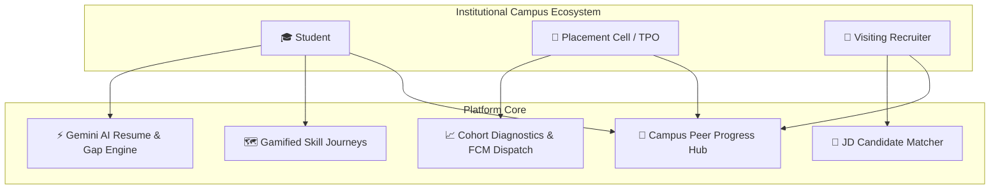

# 🎓 Campus Career Copilot

> **An AI-powered Institutional Placement & Skill Readiness Platform** designed for universities and colleges. Connects **Students**, the **Placement Cell (TPO)**, and **Campus Recruiters** into a unified ecosystem with transparent peer progress tracking, AI-driven competency gap resolution, and semantic candidate matching.

---

## 🌟 Key Highlights

- 👥 **Campus Peer Progress Hub**: Searchable institutional directory to explore classmates' technical skill profiles, target roles, readiness scores, and active learning milestones.
- 🗺️ **Gamified AI Skill Journeys**: Turns detected resume skill gaps into structured 3-stage actionable roadmaps (Concept Briefs $\rightarrow$ Practical Challenges $\rightarrow$ Self-Check Quizzes) powered by **Groq Llama 3.3 70B**.
- 📊 **TPO Cohort Diagnostics**: Real-time batch placement readiness analytics, horizontal severity-coded gap charts, department-wise filters, and 1-click targeted workshop push broadcasts via **Firebase Cloud Messaging (FCM)**.
- 🎯 **Recruiter Candidate Match**: Instant semantic candidate ranking against posted Job Descriptions (JDs) based on verified skill overlap.
- 🛡️ **Role-Based Security**: Protected routes gated by Firebase custom claims and Supabase Row Level Security (RLS).

---

## 🏛️ Ecosystem Architecture



---

## 🛠️ Tech Stack

- **Framework**: [Next.js 14](https://nextjs.org/) (App Router, Server Components & Route Handlers)
- **Database & Storage**: [Supabase](https://supabase.com/) (PostgreSQL with RLS & migrations)
- **Authentication & Push Notifications**: [Firebase Auth](https://firebase.google.com/products/auth) (Custom Role Claims) & [Firebase Cloud Messaging (FCM)](https://firebase.google.com/products/cloud-messaging)
- **AI / LLM Engine**: [Google Gemini](https://ai.google.dev/) (`gemini-3.5-flash-lite`) for fast JSON evaluation and LaTeX generation
- **Analytics & Visualizations**: [Recharts](https://recharts.org/) (Radar competency charts & horizontal gap distributions)
- **Mapping & Geolocation**: [Leaflet](https://leafletjs.com/) & [React-Leaflet](https://react-leaflet.js.org/) (Campus drive tracker)
- **Styling**: [Tailwind CSS](https://tailwindcss.com/)

---

## 🚀 Role-Based Features

### 🎓 1. For Students (`/student/*`)
- **Instant AI Resume Evaluation**: Upload a PDF resume to receive a placement readiness score (0–100), extracted competencies, and a 360° competency radar chart.
- **AI Resume Builder**: Don't have a resume? Fill out a dynamic form to instantly generate a professional, compilable LaTeX resume from scratch.
- **Skill Journeys**: Start interactive AI quests for any missing technical skill. Complete concept readings, practical code tasks, and interactive quizzes to mark gaps as **Mastered**.
- **Peer Benchmark**: Compare readiness with departmental peers to form study circles.

### 🏢 2. For Placement Cell / TPO (`/tpo/*`)
- **Cohort Readiness Diagnostics**: Live visibility into batch average scores, critical high-severity gaps, and department distributions.
- **Urgency-Ranked Student Roster**: Weakest-first student list showing individual gap counts and completed skill quests.
- **Targeted Push Broadcasts**: Filter students affected by a specific gap and dispatch push notification alerts for campus workshops with 1 click.
- **1-Click Demo Cohort Seeder**: Instant generation of 18 realistic student accounts and active learning journeys.

### 💼 3. For Campus Recruiters (`/recruiter/*`)
- **Job Description Publisher**: Post campus openings with required skills and competencies.
- **Ranked Candidate Matching**: Automatically filters opted-in students and ranks candidates by skill overlap and resume scores.

---

## 📦 Getting Started

### 1. Clone & Install Dependencies
```bash
git clone https://github.com/Sayan1776/campus-career-copilot.git
cd campus-career-copilot
npm install
```

### 2. Configure Environment Variables
Copy `.env.local.example` to `.env.local`:
```bash
cp .env.local.example .env.local
```

Fill in the required credentials:
```env
# Firebase Client
NEXT_PUBLIC_FIREBASE_API_KEY=your_firebase_api_key
NEXT_PUBLIC_FIREBASE_AUTH_DOMAIN=your_project.firebaseapp.com
NEXT_PUBLIC_FIREBASE_PROJECT_ID=your_project_id
NEXT_PUBLIC_FIREBASE_STORAGE_BUCKET=your_project.appspot.com
NEXT_PUBLIC_FIREBASE_MESSAGING_SENDER_ID=your_sender_id
NEXT_PUBLIC_FIREBASE_APP_ID=your_app_id
NEXT_PUBLIC_FIREBASE_VAPID_KEY=your_vapid_key

# Firebase Admin (Single-line stringified JSON)
FIREBASE_SERVICE_ACCOUNT_KEY={"type":"service_account",...}

# Supabase
NEXT_PUBLIC_SUPABASE_URL=https://your-project.supabase.co
NEXT_PUBLIC_SUPABASE_ANON_KEY=your_anon_key
SUPABASE_SERVICE_ROLE_KEY=your_service_role_key

# Gemini AI
GEMINI_API_KEY=your_gemini_key
GEMINI_RESUME_BUILDER_API_KEY=your_gemini_resume_builder_key

# Invite Codes
STUDENT_INVITE_CODE=STUDENT2026
TPO_INVITE_CODE=TPOADMIN2026
RECRUITER_INVITE_CODE=RECRUIT2026
```

### 3. Apply Supabase Database Migrations
Run the SQL files in order in your **Supabase SQL Editor**:
1. `supabase/migrations/0001_init.sql`
2. `supabase/migrations/0002_fix_user_id_type.sql`
3. `supabase/migrations/0003_add_fcm_token.sql`
4. `supabase/migrations/0004_campus_progress_and_journeys.sql`

### 4. Run Development Server
```bash
npm run dev
```
Open [http://localhost:3000](http://localhost:3000) in your browser.

---

## 🎬 Live Demo Walkthrough

1. **Sign Up / Sign In**:
   - Register a Student account with invite code `STUDENT2026`.
   - Register a TPO account with invite code `TPOADMIN2026`.
2. **Seed Demo Cohort (as TPO)**:
   - Go to `/tpo/dashboard` and click **⚡ Seed Demo Cohort** to populate 18 student profiles, skill gaps, and learning journeys.
3. **Explore Campus Directory**:
   - Visit `/campus/peers` to search, filter, and inspect peer progress across departments.
4. **Complete an AI Skill Journey (as Student)**:
   - Go to `/student/journeys`, select a detected gap (e.g. *System Design*), click **+ Start Quest**, and complete the interactive quiz!

---

## 📄 License
This project is licensed under the [MIT License](LICENSE).
